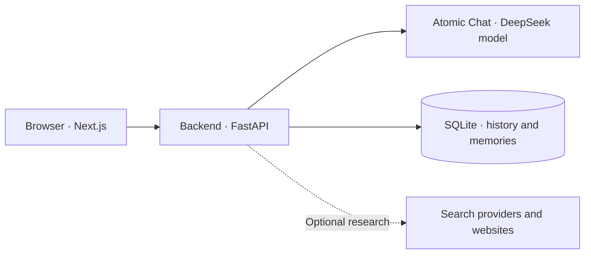

# LocalGPT

**A local AI workspace for conversations, research, and code.**

LocalGPT is a chat frontend and FastAPI backend connected to **Atomic Chat's local API**. Atomic Chat runs the model on your computer, and LocalGPT stores conversation history in SQLite.

Built with **Next.js 16 · React 19 · TypeScript · Tailwind CSS 4 · FastAPI · SQLAlchemy**.

[Getting started](#getting-started) · [Atomic Chat integration](#atomic-chat-integration) · [Configuration](#configuration) · [Deployment](#deployment) · [Troubleshooting](#troubleshooting) · [Development](#development)

## Features

- **Streaming chat:** replies arrive as they are generated, with progress messages and a stop control.
- **Conversation management:** search, rename, pin, and delete saved chats.
- **Model selection:** discover available models and adjust thinking effort from the model menu.
- **Code panels:** syntax highlighting, line numbers, copy, download, line wrapping, and an expanded view.
- **Coding workspace:** editable project files, a live web preview, desktop/mobile views, local drafts, and ZIP downloads.
- **Web research:** Auto / Search / Off control, live progress, expandable source cards, and clickable citations saved with each answer.
- **Deep research:** deeper Exa retrieval, fuller source reading, visible research stages, and downloadable Markdown reports with citations.
- **Project spaces:** group chats by project, set reusable instructions, and move existing conversations between spaces.
- **Useful memory:** explicitly save, review, edit, pause, or forget facts; each project has its own context.
- **Connection assistant:** click the status badge to diagnose FastAPI, the database, Atomic Chat, loaded models, and search configuration. Change the backend address without rebuilding the frontend.
- **Image attachments:** send images to providers and models that support vision.
- **Chat with files:** attach PDFs, Word documents, text, CSVs, and source code; preview extracted text and ask follow-up questions in a saved chat.
- **Responsive design:** a charcoal interface with coral accents for desktop and mobile.

## How it works



There are three separate services. With Atomic Chat, their usual addresses are:

| Service | Address | Purpose |
| --- | --- | --- |
| Frontend | `http://localhost:3000` | The LocalGPT interface |
| Backend | `http://127.0.0.1:8000` | Conversations, research, and model requests |
| Atomic Chat API | `http://127.0.0.1:1337/v1` | Model discovery and generation |

The frontend connects to the **FastAPI backend**. The backend connects to **Atomic Chat** using its OpenAI-compatible API.

The project's current local configuration uses `mradermacher/DeepSeek-V4-Pro-Qwen3_5-4B_Q8_0`, a `16384` token output budget, and Exa web research configured through the backend environment. Exa searches require your `EXA_API_KEY`. A fresh installation uses the defaults documented below until its environment file overrides them.

## Getting started

### Requirements

- Node.js **20.9 or newer** and npm.
- Python **3.10 or newer**.
- Git, if you are cloning the repository.
- Atomic Chat with its API server running and a model loaded.

The commands below use **Windows PowerShell**. When updating an existing installation, keep your current environment files.

### 1. Get the project

```powershell
git clone https://github.com/mixgamer159753/LocalGPT.git
cd LocalGPT
```

### 2. Install the backend

```powershell
cd backend
python -m venv venv
.\venv\Scripts\python.exe -m pip install -r requirements.txt
if (-not (Test-Path .env)) { Copy-Item .env.example .env }
```

### 3. Connect Atomic Chat

In Atomic Chat, load your model and start its API server. For an API base URL of `http://127.0.0.1:1337/v1`, set these values in `backend/.env`:

```dotenv
LLM_USE_NATIVE_OLLAMA=false
OLLAMA_HOST=http://127.0.0.1:1337
DEFAULT_MODEL=
CORS_ORIGINS=http://localhost:3000,http://127.0.0.1:3000
```

**Keep `/v1` out of `OLLAMA_HOST`.** LocalGPT adds `/v1/models` and `/v1/chat/completions` automatically. The variable retains its Ollama name for both provider modes.

Leave `DEFAULT_MODEL` blank to select an available model automatically. To prefer a specific model, use its exact ID from the provider:

```dotenv
DEFAULT_MODEL=mradermacher/DeepSeek-V4-Pro-Qwen3_5-4B_Q8_0
```

The interface displays the shorter name, while requests retain the complete ID. If a saved selection is unavailable, the backend falls back to an available model.

### 4. Start the backend

In the same terminal, from `backend/`:

```powershell
.\venv\Scripts\python.exe run.py
```

Check [backend health](http://127.0.0.1:8000/api/health) and [available models](http://127.0.0.1:8000/api/models). A healthy setup reports `status: "ok"`, `ollama_reachable: true`, and `database_connected: true`. The health field keeps its historical Ollama name even with Atomic Chat.

### 5. Start the frontend

Open a second terminal at the repository root:

```powershell
cd frontend
if (-not (Test-Path .env.local)) { Copy-Item .env.local.example .env.local }
npm ci
npm run dev
```

Open **[LocalGPT](http://localhost:3000)**, confirm the model in the header, and start a conversation. Keep the model server and both terminals running.

<details>
<summary>macOS and Linux setup</summary>

Use the same provider configuration above. Start from the repository root:

```bash
cd backend
python3 -m venv venv
./venv/bin/python -m pip install -r requirements.txt
test -f .env || cp .env.example .env
# Configure .env for your model provider before starting.
./venv/bin/python run.py
```

In a second terminal, from the repository root:

```bash
cd frontend
test -f .env.local || cp .env.local.example .env.local
npm ci
npm run dev
```

</details>

## Atomic Chat integration

LocalGPT uses these Atomic Chat endpoints:

| Request | Endpoint | Purpose |
| --- | --- | --- |
| `GET` | `http://127.0.0.1:1337/v1/models` | Discover available model IDs |
| `POST` | `http://127.0.0.1:1337/v1/chat/completions` | Generate complete or streamed responses |

The selected model ID is sent unchanged, including the `mradermacher/` prefix. The header shortens the display name to `DeepSeek-V4-Pro-Qwen3_5-4B_Q8_0` for readability.

Check model discovery from PowerShell while Atomic Chat's API is running:

```powershell
Invoke-RestMethod http://127.0.0.1:1337/v1/models
```

If Atomic Chat uses another port, change `OLLAMA_HOST` in `backend/.env` and restart the backend. The `OLLAMA_*` variable names, internal `ollama.py` module, and `ollama_reachable` health field are legacy names in the shared provider implementation. They do not mean this installation runs Ollama.

The thinking slider offers **Low, Medium, High, and Max**. LocalGPT sends an effort instruction and provider-specific controls; actual reasoning behavior depends on the model server. Image understanding also requires a vision-capable model.

## Coding workspace

Click **Workspace** in any code block to collect the code blocks from that reply into an editable project. File names are read from code-fence metadata (for example `html filename=index.html`) or nearby headings; otherwise LocalGPT assigns names such as `index.html`, `styles.css`, and `script.js`.

- Switch between **Code**, **Split**, and **Preview** views. On large screens, the workspace sits beside the chat; on smaller screens, it opens over the workspace.
- Edit files with syntax highlighting and line numbers. The preview updates after a short pause in typing. **Ctrl/Cmd + Enter** reloads it; **Tab** indents, and **Shift + Tab** moves keyboard focus out of the editor.
- Compare a **1280px desktop** viewport with a **390px mobile** viewport, scaled to fit the panel.
- Download the current file or all project files as a **ZIP**. **Reset edits** restores the original generated files after confirmation.
- The browser keeps up to eight recent drafts. Reopening the same generated project restores its edits. Drafts belong to this browser and are separate from the original chat reply; if browser storage is unavailable or full, edits remain in the current session.

Live preview supports HTML, CSS, and plain browser JavaScript. Local stylesheet and script references are inlined from workspace files. Framework code, JSX, TypeScript, SCSS, Python, and other server code require their own build tools or runtime after download. The preview displays JavaScript errors and console output.

Generated pages run in a sandboxed frame with a separate origin. External assets are disabled by default; the preview control can allow HTTPS images, fonts, stylesheets, and scripts. API requests, nested frames, and form submissions remain blocked. Workspace edits are never automatically applied to your repository or uploaded to GitHub.

## Chat with your files

Use the **paperclip** in the composer or drop files onto the message box. Attach up to **four files or images per message**. Documents can be **8 MB** each; images keep their existing **3.5 MB** limit.

- Supported documents: text-based **PDF**, **DOCX**, **TXT**, **Markdown**, **CSV/TSV**, JSON, and common source code files. ZIP archives and binary spreadsheets are not supported.
- Attachment cards show reading progress, errors, retry, and removal. Click a ready card to preview extracted text with line numbers and **Find in file**.
- Ask for a summary, explanation, comparison, or help with code. Sending files without a question requests a summary automatically.
- Saved chats retain attachments for follow-up questions. Answers show clickable **File context** labels for the files supplied to the model. Up to four files are selected per answer, prioritizing newly attached files, filenames mentioned in the question, and recent files.
- Long files use question-relevant text excerpts, with about **15,000 characters** of file context shared across the selected files. When there are no matching terms, excerpts are sampled through the document. The model is instructed to cite filenames and line ranges and disclose missing context; this is text retrieval, not full-document execution or spreadsheet calculation.
- Extraction keeps up to **120,000 characters** and the first **100 PDF pages**. Partial extraction is marked on the card and in the preview. Scanned PDFs need OCR first; unlock password-protected files before attaching them. DOCX extraction reads body paragraphs and tables, not embedded images or diagrams.

FastAPI extracts files locally and stores their text and metadata in SQLite. Original uploaded binaries are not retained. Removing an unsent card deletes its unused extracted document; deleting a conversation deletes file text that no other saved message references. Unreferenced upload drafts older than one day are removed on backend startup.

File questions stay local in **Auto** web mode. Selecting **Search** also retrieves web sources using your question; extracted file content is never passed to the web search service. Model generation uses your configured provider, normally Atomic Chat on your computer.

After updating an existing checkout, install the updated backend requirements and restart FastAPI. Startup adds the document table and optional message columns while preserving existing conversations.

```powershell
cd backend
.\venv\Scripts\python.exe -m pip install -r requirements.txt
```

### Long response handling

The backend reads the provider's finish reason. A reported token-limit stop (`length`) with visible output triggers up to **two automatic continuations**, appended to the same answer. If the model still cannot finish, the partial answer remains visible with an explicit warning. A normal model stop is not retried automatically.

The frontend's five-minute timer now measures **connection inactivity**, rather than total generation time. The backend sends keepalive events during research and private reasoning. Stream failures preserve the text already received and show a separate error instead of replacing the answer. Token-limit warnings are retained with saved replies. Older hidden browser token limits are migrated to the current 16,384-token default.

## Project spaces and memory

Use **Project space** in the sidebar to switch between **General workspace** and your projects. The **+** creates a project with a name, description, and instructions. New chats belong to the selected space; its conversation list shows only that space's chats.

Open **Project details & memory** to update instructions, pause memory use, or manage saved facts. General has **Manage memory & chats** for its own facts. A **Remember** action beside a finished message opens an editable note: review it, give it a useful label, and click **Save memory**. The app does not automatically infer or save personal facts.

- Each space keeps up to **30 memories**. New labels allow **80 characters**, values **2,000**, and project instructions **4,000**. Saving the same label updates that fact. **Forget** removes it.
- Project chats use only that project's instructions and memories. General uses its own memories. Memory is not shared across projects. Pausing project memory preserves saved facts and leaves project instructions active.
- Answers receive up to **6,000 characters** of saved facts, ordered by label. Instructions and descriptions are supplied separately. Current corrections in the conversation take precedence over older saved facts.
- **Organize chats** moves a conversation from another space into the open space. Its future answers use the destination's context; existing replies stay unchanged. Removing a project deletes its instructions and memories and moves its chats to General.
- Files remain attached to individual conversations; this feature does not automatically make every file or message in a project available to every other chat.

Projects and memories live in the backend database. Restart the updated backend to add the new tables and the optional conversation `project_id` column; existing chat history is preserved.

## Connection assistant

Click the **Ready / Backend offline / Model offline** badge in the header (the status dot on small screens). **Check connection** reads diagnostics without generating an answer or spending Exa search credits.

The checklist shows browser-to-FastAPI access, database status, the model API URL, loaded model IDs, frontend origin configuration, and whether the search key is configured. It cannot verify an Exa key's validity or remaining credits without making a search request. Model names hide the publisher in the display and retain the full API ID for requests.

Enter the FastAPI origin, click **Check connection**, then **Use this address**. The override is stored in this browser and used by chat streams, files, projects, and history. Changing servers starts a fresh chat and reloads history from the chosen server. **Reset default** restores the build's `NEXT_PUBLIC_API_URL` or the hostname/port fallback. The connection assistant changes the browser's target; provider URLs and keys still belong in `backend/.env` and require a backend restart.

An HTTPS frontend needs an HTTPS backend tunnel. Keep FastAPI and the tunnel running, and allow the frontend's exact origin in `CORS_ORIGINS`. If browser requests are blocked by CORS or the tunnel, the assistant shows corrective steps; it cannot bypass those browser restrictions. **Copy diagnostics** includes addresses and model IDs but no API keys.

## Configuration

Start with [backend/.env.example](backend/.env.example) and [frontend/.env.local.example](frontend/.env.local.example). Real environment files are ignored by Git.

### Backend — `backend/.env`

These are application defaults when a value is not set:

| Variable | Default | Purpose |
| --- | --- | --- |
| `LLM_USE_NATIVE_OLLAMA` | `false` | Use Atomic Chat's OpenAI-compatible API |
| `OLLAMA_HOST` | `http://127.0.0.1:1337` | Atomic Chat server origin, without `/v1` |
| `DEFAULT_MODEL` | Empty | Preferred model ID; otherwise select an available model |
| `BACKEND_HOST` | `127.0.0.1` | Backend bind address |
| `BACKEND_PORT` | `8000` | Backend listening port |
| `CORS_ORIGINS` | `http://localhost:3000,http://127.0.0.1:3000` | Comma-separated allowed frontend origins |
| `DATABASE_URL` | `sqlite+aiosqlite:///./localgpt.db` | Conversation and memory storage |
| `WEB_SEARCH_ENABLED` | `true` | Enable automatic web research |
| `WEB_SEARCH_PROVIDER` | `auto` | Exa when a key is set; otherwise legacy Google/DDGS. Use `exa` to require Exa |
| `EXA_API_KEY` | Empty | Server-only Exa credential |
| `WEB_SEARCH_ALWAYS` | `false` | Research most eligible prompts |
| `OLLAMA_CONNECT_TIMEOUT` | `10` | Provider connection timeout in seconds |
| `OLLAMA_READ_TIMEOUT` | `300` | Provider read timeout in seconds |
| `DEBUG` | `false` | Verbose backend logging |

The example file uses smaller research limits than the application defaults. Your local `.env` overrides these defaults; this installation selects `WEB_SEARCH_PROVIDER=exa`.

<details>
<summary>Generation and research tuning</summary>

| Variable | Application default | Purpose |
| --- | --- | --- |
| `DEFAULT_MAX_TOKENS` | `1536` | Output budget when a request omits `max_tokens` |
| `WEB_SEARCH_CACHE_TTL` | `900` | Research cache lifetime in seconds |
| `WEB_SEARCH_DEEP` | `true` | Generate related queries for legacy search; the frontend's Deep research switch is separate |
| `WEB_SEARCH_MAX_RESULTS` | `12` | Search result limit; example file sets `6` |
| `WEB_SEARCH_MAX_PAGES` | `6` | Sources supplied to the model; example file sets `3` |
| `WEB_SEARCH_DEEP_QUERIES` | `3` | Related query limit |
| `WEB_SEARCH_CONTEXT_CHARS` | `1800` | Standard research extract characters per source; Deep uses larger excerpts, normally 3,000 per source, within an 18,000-character total budget |
| `WEB_SEARCH_PAGE_TEXT_LIMIT` | `15000` | Full-page text retained per source during Deep research before prompt excerpts are selected |

The frontend requests up to `16384` output tokens by default. Atomic Chat and model limits still apply. Configure model loading, context size, and hardware options in Atomic Chat. The backend's legacy native Ollama options are not sent in Atomic Chat mode.

Exa retrieves source highlights in one request. With `WEB_SEARCH_PROVIDER=legacy`, optional `GOOGLE_API_KEY` and `GOOGLE_CSE_ID` select Google Custom Search, otherwise `ddgs` is used. The active legacy path uses search snippets. Set `WEB_SEARCH_ENABLED=false` to disable research. Greetings, date-only questions, and many writing or coding tasks skip research even in always mode.

</details>

### Exa web search setup

In your private `backend/.env`, set:

```dotenv
WEB_SEARCH_ENABLED=true
WEB_SEARCH_PROVIDER=exa
EXA_API_KEY=your-exa-api-key
```

Replace the placeholder locally with your key, or provide `EXA_API_KEY` through the backend process environment. Process environment variables take precedence over `.env`. Restart FastAPI after changing them. Keep the key out of frontend variables, Git, and chat messages.

Standard research calls `POST https://api.exa.ai/search` with `type=auto` and `contents.highlights=true`, then passes source titles, URLs, publication dates, and extracts to Atomic Chat. Atomic Chat generates the answer using your selected local model. Request shapes follow [Exa's search reference](https://exa.ai/docs/reference/search).

Use the **Web** control below the composer:

| Mode | Behavior |
| --- | --- |
| Auto | Search when fresh information is useful or you explicitly request a search |
| Search | Use web sources for questions, including ones Auto would normally skip |
| Off | Skip web research for this conversation's requests |

The choice is saved in your browser and applies to future messages across chats. Greetings and standalone date questions skip search in both Auto and Search modes. The backend must also have `WEB_SEARCH_ENABLED=true`.

Search progress appears before retrieval begins. Source chips open the original pages; **Sources** expands cards with titles, snippets, and publication dates when available. Numbered citations link to those retrieved URLs. Sources and search warnings are saved with the assistant reply and remain available when reopening the chat. Existing databases gain an optional `research` column at backend startup; old messages stay intact.

Short follow-up questions can include the previous user topic in the search query. Search providers receive those query details, but not the complete conversation or generated answers.

Successful results are cached separately by provider, query, and research depth for `WEB_SEARCH_CACHE_TTL` seconds, with up to 128 cached entries. Source limits are applied locally. Standard Exa mode uses one search request. A missing key, API failure, or empty result produces a cautious-answer instruction; it does not silently switch providers. Failed searches are not cached, so the next request can recover.

### Deep research reports

Enable **Deep research** beside the Web selector, then ask a research question. This selects **Search** mode. Turning Web **Off** or back to **Auto** resets Deep research. The browser remembers this preference for future messages.

1. Exa runs a deeper retrieval pass with `type=deep` and source highlights.
2. The backend reads the selected URLs with `POST /contents` and top-level `text=true`, following [Exa's contents reference](https://exa.ai/docs/reference/get-contents). This is a second API request and uses additional Exa credits. Existing source-count limits still apply.
3. Atomic Chat writes a report with a short summary, grouped findings, source agreements and conflicts, limitations, and next steps when appropriate. Retrieved excerpts remain bounded for the local model; this is not an exhaustive review of every page.

The source panel shows **Find sources → Read pages → Write report**, then the number of sources and full pages successfully read. If page extraction fails or only some pages are available, search excerpts are retained and the report displays a limitation. With a legacy search provider, Deep research explicitly falls back to snippets and explains that fuller reading requires Exa.

Click **Report** beside the finished reply to download Markdown with the question, answer, source links, retrieval limitations, and export date. Incomplete responses are marked in the exported report. Source metadata and research depth are saved with the chat, so reports can also be downloaded after reopening it.

Deep research keeps generation on Atomic Chat; it does not call Exa's answer or Agent API. Your question and selected public source URLs reach Exa. File text, project instructions, and saved memories are not included in Exa requests. Attached-file questions can still use Deep research when you explicitly choose it.

### Frontend — `frontend/.env.local`

| Variable | Default | Purpose |
| --- | --- | --- |
| `NEXT_PUBLIC_API_URL` | Empty | Explicit **FastAPI backend origin** |
| `NEXT_PUBLIC_BACKEND_PORT` | `8000` | Backend port when the API URL is blank |
| `NEXT_ALLOWED_DEV_ORIGINS` | Empty | Hosts allowed to load Next.js development resources |

With a blank API URL, the browser uses its current protocol and hostname with the backend port. For a backend on another host:

```dotenv
NEXT_PUBLIC_API_URL=http://192.168.1.20:8000
```

Use the backend origin only: **no `/api`, no `/v1`, and no model-server port**. Restart the frontend after editing local values. Public environment variables are included in browser code.

The connection assistant's browser override takes precedence over these frontend variables. Reset it in the assistant to use the configured default again.

## Deployment

### Local network

For a PC with LAN address `192.168.1.20`, set `backend/.env` to:

```dotenv
BACKEND_HOST=0.0.0.0
CORS_ORIGINS=http://localhost:3000,http://127.0.0.1:3000,http://192.168.1.20:3000
```

Set `frontend/.env.local` to:

```dotenv
NEXT_PUBLIC_API_URL=
NEXT_PUBLIC_BACKEND_PORT=8000
NEXT_ALLOWED_DEV_ORIGINS=192.168.1.20
```

Restart the backend, run `npm run dev:lan` from `frontend/`, and open `http://192.168.1.20:3000` on another device. Replace the example address with your PC's address and allow the frontend and backend ports through your firewall.

### Vercel frontend + local backend

Vercel hosts the frontend. Your computer continues to run FastAPI and the model server.

1. Install and configure [ngrok](https://ngrok.com/docs/start). With the backend running, start `ngrok http 8000` in another terminal.
2. Import this GitHub repository into Vercel. Select **Next.js** and set the project **Root Directory** to `frontend`, as described in [Vercel's monorepo guide](https://vercel.com/docs/monorepos).
3. Add `NEXT_PUBLIC_API_URL` to the project's environment variables as **Config** for Production. Use the HTTPS backend tunnel origin, for example `https://your-tunnel.ngrok-free.app`.
4. Add your frontend origin to `CORS_ORIGINS` in `backend/.env`, then restart the backend:

   ```dotenv
   CORS_ORIGINS=http://localhost:3000,http://127.0.0.1:3000,https://local-gpt-three.vercel.app
   ```

5. Deploy or redeploy the frontend. [Vercel environment changes apply to new deployments](https://vercel.com/docs/environment-variables), so saving the variable alone does not update an existing build.

Keep the backend, model server, and tunnel running while using the hosted app. If the tunnel address changes, use the connection assistant to update this browser immediately, or update `NEXT_PUBLIC_API_URL` and redeploy to change the default for all browsers. Never use `127.0.0.1:1337` as the hosted frontend's backend URL.

The API currently has no authentication. A public tunnel exposes conversation and memory endpoints; protect access before sharing the backend publicly. CORS controls browser origins and does not authenticate callers.

The included `start.bat` is a Windows convenience launcher for the backend and ngrok. It locates the checkout relative to the launcher and starts the backend on port `8000`. It does not start the frontend or Atomic Chat; start those separately. Use the manual commands above when you need a different backend port.

## Troubleshooting

| Symptom | What to check |
| --- | --- |
| **Backend offline** | Open `/api/health` at the FastAPI address. Check the frontend API URL, backend process, tunnel, and allowed CORS origin. |
| **No running session found for model** | Load the model in Atomic Chat and refresh the model list. Use the exact ID from `/v1/models`, including its publisher prefix. |
| **404 / Not Found** | Check the two base URLs: `OLLAMA_HOST` points to the model server; `NEXT_PUBLIC_API_URL` points to FastAPI. Neither should include `/v1` or `/api`. |
| **Database issue** | Check `database_connected` in `/api/health`, backend logs, and write access to the database directory. Start the backend from `backend/`. |
| **Vercel still uses an old URL** | Confirm the Production environment value, redeploy, and confirm the deployment uses the intended Git commit. |
| **LAN page opens but chat fails** | Check port `8000`, `BACKEND_HOST=0.0.0.0`, firewall access, and the exact LAN frontend origin in `CORS_ORIGINS`. |
| **Slow or empty responses** | Confirm the model is loaded and fits available RAM/VRAM. Try lower thinking effort and inspect provider logs. |
| **Images are rejected** | Choose a model and provider that support vision. Attachment support in the UI does not add vision support to a text-only model. |
| **File upload fails** | Restart the updated backend and install `backend/requirements.txt`. Check the 8 MB document limit, supported extension, and unlocked/readable text. Scanned PDFs require OCR. |
| **An answer ends early** | Update and restart both apps together. Explicit token-limit stops are continued automatically; remaining limits appear as warnings. A normal provider stop can require a shorter task or adjusted model settings in Atomic Chat. |

For Windows port errors such as `[WinError 10013]`, inspect port `8000`:

```powershell
Get-NetTCPConnection -LocalPort 8000 | Select-Object LocalAddress, LocalPort, State, OwningProcess
```

If needed, change `BACKEND_PORT` to `8001` and `NEXT_PUBLIC_BACKEND_PORT` to `8001`, then restart both apps. If an explicit `NEXT_PUBLIC_API_URL` is set, update its port too.

## Data and privacy

- Starting the backend from `backend/` stores chats, projects, memories, and extracted file text in `backend/localgpt.db` by default.
- Selected models, pinned conversation IDs, frontend preferences, and the backend address override are stored in the browser's local storage.
- The database, environment files, installed dependencies, and generated caches are excluded from Git.
- Model inference stays on your computer when you use a local provider. Optional web research sends search queries to external providers. Exa returns extracted source content; the API key remains on the backend.
- Generation uses a short recent message history; older saved messages remain available in the conversation view.

## Development

### Repository layout

```text
LocalGPT/
├── backend/
│   ├── app/
│   │   ├── api/           Health, diagnostics, models, conversations, projects, memories, chat, and files
│   │   ├── core/          Environment configuration
│   │   ├── database/      SQLite connection and SQLAlchemy models
│   │   ├── schemas/       Request and response validation
│   │   └── services/      Model clients, streaming, memory, web research, and document extraction
│   ├── tests/             Backend unit tests
│   ├── .env.example       Backend configuration template
│   ├── requirements.txt
│   └── run.py
├── frontend/
│   ├── app/               Pages, layout, and global styles
│   ├── components/        Chat interface and code panels
│   ├── hooks/             Conversations, models, preferences, and streaming
│   ├── lib/               API client and syntax highlighting
│   ├── types/             Shared TypeScript types
│   ├── .env.local.example Frontend configuration template
│   └── package.json
└── start.bat              Windows backend and tunnel launcher
```

### Frontend scripts

Run these from `frontend/`:

| Command | Purpose |
| --- | --- |
| `npm run dev` | Local development on port `3000` |
| `npm run dev:lan` | Development with LAN access on port `3000` |
| `npm run lint` | ESLint checks |
| `npm run build` | Production build and TypeScript checks |
| `npm run start` | Serve a previously built production frontend |

### Backend tests

Run from `backend/`:

```powershell
.\venv\Scripts\python.exe -m unittest discover
```

The tests set their own provider and research configuration, so they do not depend on your personal `.env` values.

### API reference

Interactive documentation is available at **[FastAPI docs](http://127.0.0.1:8000/docs)** while the backend is running.

| Method | Route | Purpose |
| --- | --- | --- |
| `GET` | `/api/health` | Provider reachability and database status |
| `GET` | `/api/diagnostics` | Connection configuration and loaded models, without secrets |
| `GET` | `/api/models` | Available provider models |
| `GET`, `POST` | `/api/conversations` | List or create conversations |
| `GET`, `PATCH`, `DELETE` | `/api/conversations/{id}` | Read, rename, move between projects, or delete a conversation |
| `GET`, `POST` | `/api/projects` | List or create project spaces |
| `PUT`, `DELETE` | `/api/projects/{id}` | Update a project or remove it while preserving chats in General |
| `GET`, `POST` | `/api/projects/{id}/memories` | List or upsert project memory by label |
| `DELETE` | `/api/projects/{id}/memories/{memory_id}` | Forget a project memory |
| `GET`, `POST` | `/api/memories` | List or save user memories |
| `DELETE` | `/api/memories/{id}` | Remove a memory |
| `POST` | `/api/chat` | Generate and save a complete response |
| `POST` | `/api/chat/stream` | Stream a response as newline-delimited JSON |
| `POST` | `/api/files?name={filename}` | Upload raw file bytes and return extracted-document metadata |
| `GET` | `/api/files/{id}` | Preview extracted file text |
| `DELETE` | `/api/files/{id}` | Remove an unused uploaded draft |

Streaming events use `status` for progress (with optional `phase`, `query`, `stage`, and `depth`), `research` for web source metadata including `depth` and `pages_read`, `files` for file context metadata, `ping` for keepalive, `token` for generated text, `error` for failures, and `done` for completed processing. `done` includes the provider's `finish_reason` and an optional incomplete-answer `warning`. Chat messages accept an `attachments` array of up to four uploaded document IDs. Saved messages return attachment metadata and optional `generation_warning`. `web_search_mode` accepts `auto`, `always`, or `off`; `web_search_enabled=false` also disables web retrieval. `research_depth` accepts `standard` or `deep`; `project_id` selects the project for a new chat. Existing chats use their persisted project. PATCH a conversation with `project_id: null` to move it to General. Keep backend and frontend changes together when editing this protocol.
