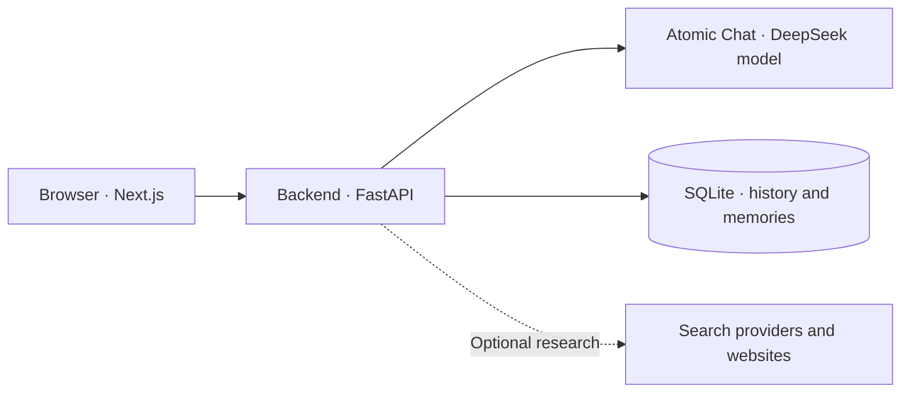

# LocalGPT

**A local AI workspace for conversations, research, and code.**

LocalGPT is a chat frontend and FastAPI backend connected to **Atomic Chat's local API**. Atomic Chat runs the model on your computer, and LocalGPT stores conversation history in SQLite.

Built with **Next.js 16 · React 19 · TypeScript · Tailwind CSS 4 · FastAPI · SQLAlchemy**.

[Getting started](#getting-started) · [Atomic Chat integration](#atomic-chat-integration) · [Configuration](#configuration) · [Deployment](#deployment) · [Troubleshooting](#troubleshooting) · [Development](#development)

## Features

- **Streaming chat:** replies arrive as they are generated, with progress messages and a stop control.
- **Conversation management:** search, rename, pin, and delete saved chats.
- **Model selection:** discover available models and adjust thinking effort from the model menu.
- **Code panels:** syntax highlighting, line numbers, copy, download, line wrapping, and an expanded view.
- **Web research:** optional searches and source page reading before the model answers.
- **Image attachments:** send images to providers and models that support vision.
- **Responsive design:** a charcoal interface with coral accents for desktop and mobile.

## How it works



There are three separate services. With Atomic Chat, their usual addresses are:

| Service | Address | Purpose |
| --- | --- | --- |
| Frontend | `http://localhost:3000` | The LocalGPT interface |
| Backend | `http://127.0.0.1:8000` | Conversations, research, and model requests |
| Atomic Chat API | `http://127.0.0.1:1337/v1` | Model discovery and generation |

The frontend connects to the **FastAPI backend**. The backend connects to **Atomic Chat** using its OpenAI-compatible API.

The project's current local configuration uses `mradermacher/DeepSeek-V4-Pro-Qwen3_5-4B_Q8_0`, a `16384` token output budget, and `WEB_SEARCH_ENABLED=false`. Web research is implemented but disabled in this installation. A fresh installation uses the defaults documented below until its environment file overrides them.

## Getting started

### Requirements

- Node.js **20.9 or newer** and npm.
- Python **3.10 or newer**.
- Git, if you are cloning the repository.
- Atomic Chat with its API server running and a model loaded.

The commands below use **Windows PowerShell**. When updating an existing installation, keep your current environment files.

### 1. Get the project

```powershell
git clone https://github.com/mixgamer159753/LocalGPT.git
cd LocalGPT
```

### 2. Install the backend

```powershell
cd backend
python -m venv venv
.\venv\Scripts\python.exe -m pip install -r requirements.txt
if (-not (Test-Path .env)) { Copy-Item .env.example .env }
```

### 3. Connect Atomic Chat

In Atomic Chat, load your model and start its API server. For an API base URL of `http://127.0.0.1:1337/v1`, set these values in `backend/.env`:

```dotenv
LLM_USE_NATIVE_OLLAMA=false
OLLAMA_HOST=http://127.0.0.1:1337
DEFAULT_MODEL=
CORS_ORIGINS=http://localhost:3000,http://127.0.0.1:3000
```

**Keep `/v1` out of `OLLAMA_HOST`.** LocalGPT adds `/v1/models` and `/v1/chat/completions` automatically. The variable retains its Ollama name for both provider modes.

Leave `DEFAULT_MODEL` blank to select an available model automatically. To prefer a specific model, use its exact ID from the provider:

```dotenv
DEFAULT_MODEL=mradermacher/DeepSeek-V4-Pro-Qwen3_5-4B_Q8_0
```

The interface displays the shorter name, while requests retain the complete ID. If a saved selection is unavailable, the backend falls back to an available model.

### 4. Start the backend

In the same terminal, from `backend/`:

```powershell
.\venv\Scripts\python.exe run.py
```

Check [backend health](http://127.0.0.1:8000/api/health) and [available models](http://127.0.0.1:8000/api/models). A healthy setup reports `status: "ok"`, `ollama_reachable: true`, and `database_connected: true`. The health field keeps its historical Ollama name even with Atomic Chat.

### 5. Start the frontend

Open a second terminal at the repository root:

```powershell
cd frontend
if (-not (Test-Path .env.local)) { Copy-Item .env.local.example .env.local }
npm ci
npm run dev
```

Open **[LocalGPT](http://localhost:3000)**, confirm the model in the header, and start a conversation. Keep the model server and both terminals running.

<details>
<summary>macOS and Linux setup</summary>

Use the same provider configuration above. Start from the repository root:

```bash
cd backend
python3 -m venv venv
./venv/bin/python -m pip install -r requirements.txt
test -f .env || cp .env.example .env
# Configure .env for your model provider before starting.
./venv/bin/python run.py
```

In a second terminal, from the repository root:

```bash
cd frontend
test -f .env.local || cp .env.local.example .env.local
npm ci
npm run dev
```

</details>

## Atomic Chat integration

LocalGPT uses these Atomic Chat endpoints:

| Request | Endpoint | Purpose |
| --- | --- | --- |
| `GET` | `http://127.0.0.1:1337/v1/models` | Discover available model IDs |
| `POST` | `http://127.0.0.1:1337/v1/chat/completions` | Generate complete or streamed responses |

The selected model ID is sent unchanged, including the `mradermacher/` prefix. The header shortens the display name to `DeepSeek-V4-Pro-Qwen3_5-4B_Q8_0` for readability.

Check model discovery from PowerShell while Atomic Chat's API is running:

```powershell
Invoke-RestMethod http://127.0.0.1:1337/v1/models
```

If Atomic Chat uses another port, change `OLLAMA_HOST` in `backend/.env` and restart the backend. The `OLLAMA_*` variable names, internal `ollama.py` module, and `ollama_reachable` health field are legacy names in the shared provider implementation. They do not mean this installation runs Ollama.

The thinking slider offers **Low, Medium, High, and Max**. LocalGPT sends an effort instruction and provider-specific controls; actual reasoning behavior depends on the model server. Image understanding also requires a vision-capable model.

## Configuration

Start with [backend/.env.example](backend/.env.example) and [frontend/.env.local.example](frontend/.env.local.example). Real environment files are ignored by Git.

### Backend — `backend/.env`

These are application defaults when a value is not set:

| Variable | Default | Purpose |
| --- | --- | --- |
| `LLM_USE_NATIVE_OLLAMA` | `false` | Use Atomic Chat's OpenAI-compatible API |
| `OLLAMA_HOST` | `http://127.0.0.1:1337` | Atomic Chat server origin, without `/v1` |
| `DEFAULT_MODEL` | Empty | Preferred model ID; otherwise select an available model |
| `BACKEND_HOST` | `127.0.0.1` | Backend bind address |
| `BACKEND_PORT` | `8000` | Backend listening port |
| `CORS_ORIGINS` | `http://localhost:3000,http://127.0.0.1:3000` | Comma-separated allowed frontend origins |
| `DATABASE_URL` | `sqlite+aiosqlite:///./localgpt.db` | Conversation and memory storage |
| `WEB_SEARCH_ENABLED` | `true` | Enable automatic web research |
| `WEB_SEARCH_ALWAYS` | `false` | Research most eligible prompts |
| `OLLAMA_CONNECT_TIMEOUT` | `10` | Provider connection timeout in seconds |
| `OLLAMA_READ_TIMEOUT` | `300` | Provider read timeout in seconds |
| `DEBUG` | `false` | Verbose backend logging |

The example file uses smaller research limits than the application defaults. Your local `.env` overrides these defaults; for example, this installation disables web research.

<details>
<summary>Generation and research tuning</summary>

| Variable | Application default | Purpose |
| --- | --- | --- |
| `DEFAULT_MAX_TOKENS` | `1536` | Output budget when a request omits `max_tokens` |
| `WEB_SEARCH_CACHE_TTL` | `900` | Research cache lifetime in seconds |
| `WEB_SEARCH_DEEP` | `true` | Search related queries and read source pages |
| `WEB_SEARCH_MAX_RESULTS` | `12` | Search result limit; example file sets `6` |
| `WEB_SEARCH_MAX_PAGES` | `6` | Source page limit; example file sets `3` |
| `WEB_SEARCH_DEEP_QUERIES` | `3` | Related query limit |

The frontend requests up to `16384` output tokens by default. Atomic Chat and model limits still apply. Configure model loading, context size, and hardware options in Atomic Chat. The backend's legacy native Ollama options are not sent in Atomic Chat mode.

Web research uses `ddgs` for search. Optional `GOOGLE_API_KEY` and `GOOGLE_CSE_ID` enable Google Custom Search. Set `WEB_SEARCH_ENABLED=false` to disable research. Greetings, date-only questions, and many writing or coding tasks skip research even in always mode.

</details>

### Frontend — `frontend/.env.local`

| Variable | Default | Purpose |
| --- | --- | --- |
| `NEXT_PUBLIC_API_URL` | Empty | Explicit **FastAPI backend origin** |
| `NEXT_PUBLIC_BACKEND_PORT` | `8000` | Backend port when the API URL is blank |
| `NEXT_ALLOWED_DEV_ORIGINS` | Empty | Hosts allowed to load Next.js development resources |

With a blank API URL, the browser uses its current protocol and hostname with the backend port. For a backend on another host:

```dotenv
NEXT_PUBLIC_API_URL=http://192.168.1.20:8000
```

Use the backend origin only: **no `/api`, no `/v1`, and no model-server port**. Restart the frontend after editing local values. Public environment variables are included in browser code.

## Deployment

### Local network

For a PC with LAN address `192.168.1.20`, set `backend/.env` to:

```dotenv
BACKEND_HOST=0.0.0.0
CORS_ORIGINS=http://localhost:3000,http://127.0.0.1:3000,http://192.168.1.20:3000
```

Set `frontend/.env.local` to:

```dotenv
NEXT_PUBLIC_API_URL=
NEXT_PUBLIC_BACKEND_PORT=8000
NEXT_ALLOWED_DEV_ORIGINS=192.168.1.20
```

Restart the backend, run `npm run dev:lan` from `frontend/`, and open `http://192.168.1.20:3000` on another device. Replace the example address with your PC's address and allow the frontend and backend ports through your firewall.

### Vercel frontend + local backend

Vercel hosts the frontend. Your computer continues to run FastAPI and the model server.

1. Install and configure [ngrok](https://ngrok.com/docs/start). With the backend running, start `ngrok http 8000` in another terminal.
2. Import this GitHub repository into Vercel. Select **Next.js** and set the project **Root Directory** to `frontend`, as described in [Vercel's monorepo guide](https://vercel.com/docs/monorepos).
3. Add `NEXT_PUBLIC_API_URL` to the project's environment variables as **Config** for Production. Use the HTTPS backend tunnel origin, for example `https://your-tunnel.ngrok-free.app`.
4. Add your frontend origin to `CORS_ORIGINS` in `backend/.env`, then restart the backend:

   ```dotenv
   CORS_ORIGINS=http://localhost:3000,http://127.0.0.1:3000,https://local-gpt-three.vercel.app
   ```

5. Deploy or redeploy the frontend. [Vercel environment changes apply to new deployments](https://vercel.com/docs/environment-variables), so saving the variable alone does not update an existing build.

Keep the backend, model server, and tunnel running while using the hosted app. If the tunnel address changes, update `NEXT_PUBLIC_API_URL` and redeploy. Never use `127.0.0.1:1337` as the hosted frontend's backend URL.

The API currently has no authentication. A public tunnel exposes conversation and memory endpoints; protect access before sharing the backend publicly. CORS controls browser origins and does not authenticate callers.

The included `start.bat` is a Windows convenience launcher for the backend and ngrok. It locates the checkout relative to the launcher and starts the backend on port `8000`. It does not start the frontend or Atomic Chat; start those separately. Use the manual commands above when you need a different backend port.

## Troubleshooting

| Symptom | What to check |
| --- | --- |
| **Backend offline** | Open `/api/health` at the FastAPI address. Check the frontend API URL, backend process, tunnel, and allowed CORS origin. |
| **No running session found for model** | Load the model in Atomic Chat and refresh the model list. Use the exact ID from `/v1/models`, including its publisher prefix. |
| **404 / Not Found** | Check the two base URLs: `OLLAMA_HOST` points to the model server; `NEXT_PUBLIC_API_URL` points to FastAPI. Neither should include `/v1` or `/api`. |
| **Database issue** | Check `database_connected` in `/api/health`, backend logs, and write access to the database directory. Start the backend from `backend/`. |
| **Vercel still uses an old URL** | Confirm the Production environment value, redeploy, and confirm the deployment uses the intended Git commit. |
| **LAN page opens but chat fails** | Check port `8000`, `BACKEND_HOST=0.0.0.0`, firewall access, and the exact LAN frontend origin in `CORS_ORIGINS`. |
| **Slow or empty responses** | Confirm the model is loaded and fits available RAM/VRAM. Try lower thinking effort and inspect provider logs. |
| **Images are rejected** | Choose a model and provider that support vision. Attachment support in the UI does not add vision support to a text-only model. |

For Windows port errors such as `[WinError 10013]`, inspect port `8000`:

```powershell
Get-NetTCPConnection -LocalPort 8000 | Select-Object LocalAddress, LocalPort, State, OwningProcess
```

If needed, change `BACKEND_PORT` to `8001` and `NEXT_PUBLIC_BACKEND_PORT` to `8001`, then restart both apps. If an explicit `NEXT_PUBLIC_API_URL` is set, update its port too.

## Data and privacy

- Starting the backend from `backend/` stores chats and memories in `backend/localgpt.db` by default.
- Selected models, pinned conversation IDs, and frontend preferences are stored in the browser's local storage.
- The database, environment files, installed dependencies, and generated caches are excluded from Git.
- Model inference stays on your computer when you use a local provider. Optional web research sends search queries and fetches pages from external services.
- Generation uses a short recent message history; older saved messages remain available in the conversation view.

## Development

### Repository layout

```text
LocalGPT/
├── backend/
│   ├── app/
│   │   ├── api/           Health, models, conversations, memories, and chat
│   │   ├── core/          Environment configuration
│   │   ├── database/      SQLite connection and SQLAlchemy models
│   │   ├── schemas/       Request and response validation
│   │   └── services/      Model clients, streaming, memory, and web research
│   ├── tests/             Backend unit tests
│   ├── .env.example       Backend configuration template
│   ├── requirements.txt
│   └── run.py
├── frontend/
│   ├── app/               Pages, layout, and global styles
│   ├── components/        Chat interface and code panels
│   ├── hooks/             Conversations, models, preferences, and streaming
│   ├── lib/               API client and syntax highlighting
│   ├── types/             Shared TypeScript types
│   ├── .env.local.example Frontend configuration template
│   └── package.json
└── start.bat              Windows backend and tunnel launcher
```

### Frontend scripts

Run these from `frontend/`:

| Command | Purpose |
| --- | --- |
| `npm run dev` | Local development on port `3000` |
| `npm run dev:lan` | Development with LAN access on port `3000` |
| `npm run lint` | ESLint checks |
| `npm run build` | Production build and TypeScript checks |
| `npm run start` | Serve a previously built production frontend |

### Backend tests

Run from `backend/`:

```powershell
.\venv\Scripts\python.exe -m unittest discover
```

The tests set their own provider and research configuration, so they do not depend on your personal `.env` values.

### API reference

Interactive documentation is available at **[FastAPI docs](http://127.0.0.1:8000/docs)** while the backend is running.

| Method | Route | Purpose |
| --- | --- | --- |
| `GET` | `/api/health` | Provider reachability and database status |
| `GET` | `/api/models` | Available provider models |
| `GET`, `POST` | `/api/conversations` | List or create conversations |
| `GET`, `PATCH`, `DELETE` | `/api/conversations/{id}` | Read, rename, or delete a conversation |
| `GET`, `POST` | `/api/memories` | List or save user memories |
| `DELETE` | `/api/memories/{id}` | Remove a memory |
| `POST` | `/api/chat` | Generate and save a complete response |
| `POST` | `/api/chat/stream` | Stream a response as newline-delimited JSON |

Streaming events use `status` for progress, `token` for generated text, `error` for failures, and `done` for successful completion. Keep backend and frontend changes together when editing this protocol.
